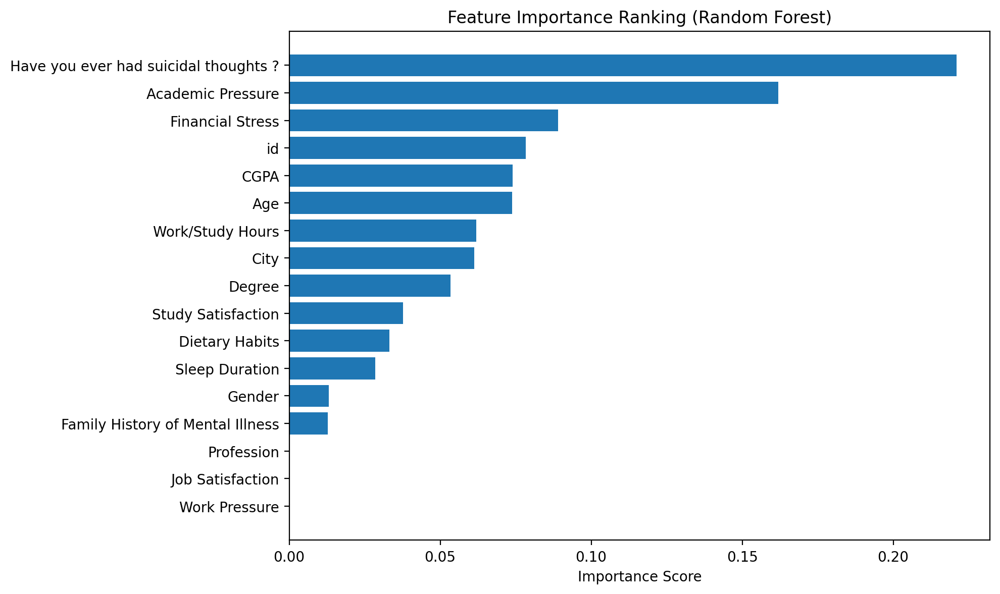

# Student Mental Health Predictive Analytics

A machine-learning analysis of factors associated with student depression using the **Student Depression Dataset**. This project was developed as part of my research through **Pioneer Academics**, supervised by **Dr. Anasse Bari**.

The project compares three classification models and uses Random Forest feature importance to examine which variables contribute most strongly to prediction.

## Project Overview

Student mental health is influenced by academic, financial, behavioral, and personal factors. This project explores whether those variables can be used to predict the dataset's binary `Depression` outcome and which features are most informative to the models.

The implementation includes:

- preprocessing of numerical and categorical variables
- median imputation for missing values
- feature standardization
- Random Forest feature-importance ranking
- K-Nearest Neighbors (KNN)
- Random Forest
- Gradient Boosting
- stratified 5-fold cross-validation
- evaluation using ROC-AUC, precision, recall, and F1 score

## Results

The original project analysis produced the following mean cross-validation results:

| Model | ROC-AUC | Precision | Recall | F1 |
| --- | ---: | ---: | ---: | ---: |
| KNN | 0.874 | 0.828 | 0.871 | 0.849 |
| Random Forest | 0.915 | 0.854 | 0.880 | 0.867 |
| Gradient Boosting | **0.921** | **0.857** | **0.884** | **0.871** |

Across the feature-ranking analysis, **suicidal thoughts, academic pressure, and financial stress** emerged as the strongest predictors.



## Dataset

This repository does **not** redistribute the dataset. It can be downloaded from Kaggle:

**Student Depression Dataset — Adil Shamim**  
https://www.kaggle.com/datasets/adilshamim8/student-depression-dataset

After downloading it, create a `data/` directory and save the CSV as:

```text
data/student_depression_dataset.csv
```

## Repository Structure

```text
student-mental-health-predictive-analytics/
├── README.md
├── requirements.txt
├── .gitignore
├── figures/
│   └── feature_importance.png
└── src/
    └── student_mental_health.py
```

## Running the Project

Clone the repository and install the dependencies:

```bash
pip install -r requirements.txt
```

Download the dataset as described above, then run:

```bash
python src/student_mental_health.py
```

You can also provide a custom dataset path:

```bash
python src/student_mental_health.py --data /path/to/dataset.csv
```

The script prints the feature ranking and cross-validation metrics and saves the feature-importance visualization to `figures/feature_importance.png`.

## Tools

Python, pandas, NumPy, scikit-learn, and Matplotlib.

## Limitations

This analysis uses a public, self-reported student dataset and should be interpreted as a proof of concept rather than a clinical diagnostic system. The data come from a single dataset rather than a prospective or multi-site study, and the models have not been validated for clinical deployment.

The repository preserves the preprocessing and evaluation approach used in the final project code. In that implementation, encoding, imputation, and scaling are performed before cross-validation. A stricter future implementation would fit preprocessing separately within each training fold using a scikit-learn pipeline to further reduce the risk of data leakage.

## Author

**Youssef Selim**  
Data Science, Claremont McKenna College
